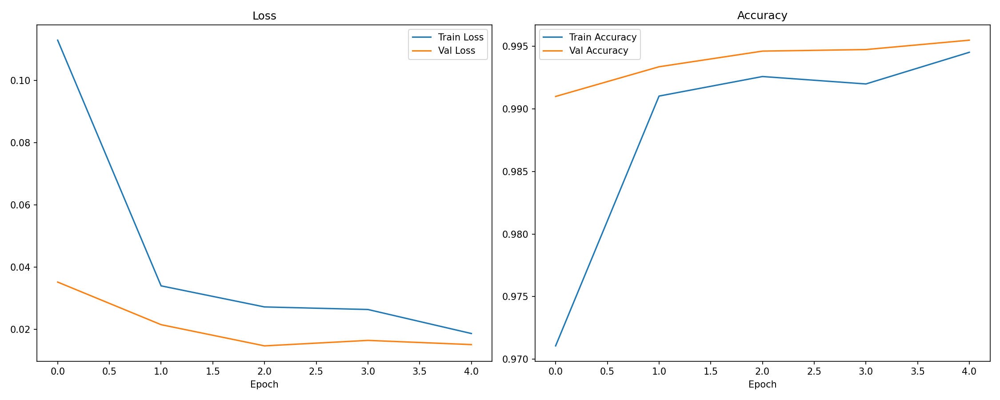
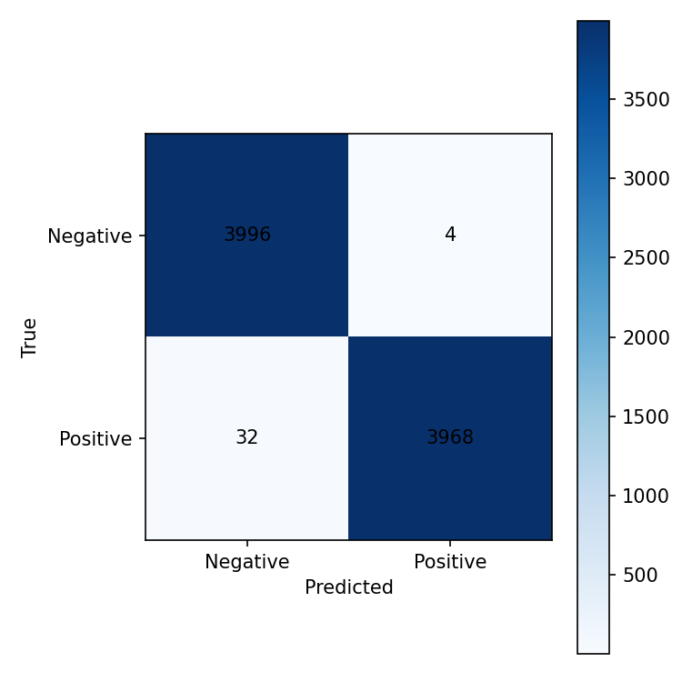
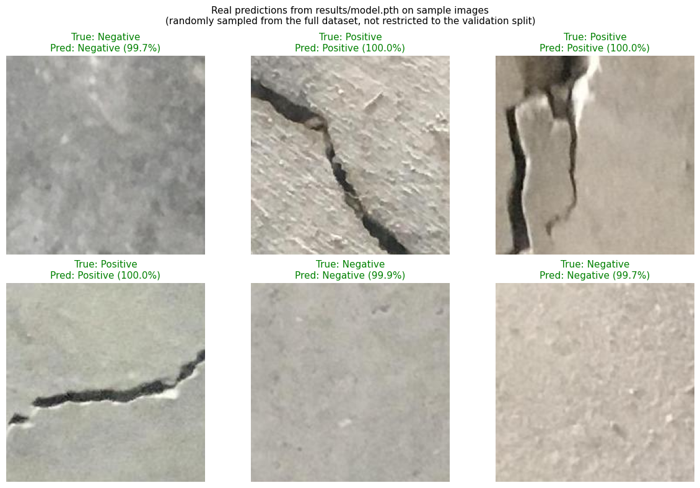

# Concrete Crack Detection (CNN, PyTorch)

> **A note on the name:** this repository is titled "Dyeing Fault
> Detection," but the dataset actually used is the public **Concrete Crack
> Images for Classification** dataset (positive/negative crack patches of
> concrete surfaces) — not textile dyeing-fault data. The original
> notebook downloaded it directly from an IBM Cognitive Class course URL.
> This README describes what the code actually does. If you want the
> GitHub repo name to match, rename it to something like
> `concrete-crack-detection` — I can't do that from here since it needs
> repo admin access.

A small CNN that classifies 227x227 concrete surface images as containing
a crack or not.

## Results

Trained for 5 epochs on the full dataset (40,000 images, 80/20 stratified
train/val split), image size 64x64, Adam optimizer (lr=1e-3).

| Epoch | Train Loss | Train Acc | Val Loss | Val Acc |
|-------|-----------|-----------|----------|---------|
| 0 | 0.113 | 97.1% | 0.035 | 99.1% |
| 1 | 0.034 | 99.1% | 0.021 | 99.3% |
| 2 | 0.027 | 99.3% | 0.015 | 99.5% |
| 3 | 0.026 | 99.2% | 0.016 | 99.5% |
| 4 | 0.019 | 99.5% | 0.015 | **99.6%** |



Held-out validation set (8,000 images), full classification report:

| Class | Precision | Recall | F1 |
|---|---|---|---|
| Negative | 0.992 | 0.999 | 0.996 |
| Positive | 0.999 | 0.992 | 0.995 |



### Example predictions



Six real inferences from `results/model.pth`, run with
`scripts/make_prediction_demo.py` — actual model output on actual images,
not mockups. These are sampled randomly from the full dataset (not
restricted to the validation split), with the true label, predicted label,
and confidence shown for each. Regenerate with:

```bash
python scripts/make_prediction_demo.py
```

This dataset is known to be easily separable (surface cracks are visually
distinct at this resolution, and it's a widely-used introductory computer
vision benchmark), which is why accuracy is this high with a fairly small
model — this is not a claim of a hard research problem solved, just an
honest report of what a straightforward CNN gets on this data. All numbers
above are from an actual training run of this code (`results/history.json`,
`results/classification_report.json`), not estimated or copied from
elsewhere.

## What was actually wrong with the original notebook

The original `Crack_Image_Detection.ipynb` never produced a trained model:

- Its model was `Flatten -> Linear -> Linear` — not a convolutional network
  at all.
- It had a shape bug: the model was constructed with `input_shape=3`
  but was actually fed 51,529 flattened features per image (`227*227`
  pixels flattened). The training cell's output shows a progress bar stuck
  at `0/5` — the run never got there.
- There were three separate, incomplete rewrites of the same `Dataset`
  class (`CustomDataset`, `CustomDataset2`,
  `CustomDatasetWithOutSpecificOrientation`), none used consistently.

This rewrite replaces all of that with a real (if intentionally small)
CNN — three `Conv2d -> BatchNorm -> ReLU -> MaxPool` blocks, global average
pooling, and a single-logit head trained with `BCEWithLogitsLoss` — and a
single `ImageFolder`-based data pipeline with a proper stratified split
instead of three abandoned custom `Dataset` attempts.

## Dataset

[Concrete Crack Images for Classification](https://www.kaggle.com/datasets/arunrk7/surface-crack-detection)
(40,000 images, 227x227, balanced Positive/Negative). Not committed to this
repository — download it and place it as:

```
resources/data/Positive/*.jpg
resources/data/Negative/*.jpg
```

## Project structure

```
.
├── src/crack_detector/
│   ├── data.py       # ImageFolder + stratified train/val split
│   ├── model.py       # SimpleCrackCNN
│   ├── engine.py       # train/eval loops + classification report
│   ├── train.py       # CLI entry point
│   ├── predict.py     # single-image inference
│   └── utils.py       # seeding, device selection, checkpoint I/O, plotting
├── tests/               # unit tests (synthetic data, no dataset download required)
├── notebooks/           # original exploratory notebook, kept for provenance
├── scripts/             # make_prediction_demo.py — regenerates assets/prediction_examples.png
├── assets/               # demo images referenced in this README
└── results/             # training history, curves, confusion matrix, report
```

## Setup

```bash
python -m venv .venv && source .venv/bin/activate
pip install -r requirements-dev.txt
pip install -e .
```

## Usage

Train:

```bash
python -m crack_detector.train --data-dir resources/data --epochs 5
```

Use `--subset-size 4000` for a fast run on a fraction of the data while
iterating.

Predict on a single image:

```bash
python -m crack_detector.predict assets/examples/positive_example.jpg --checkpoint results/model.pth
```

Run tests:

```bash
pytest -v
```

## License

MIT — see [LICENSE](LICENSE).
